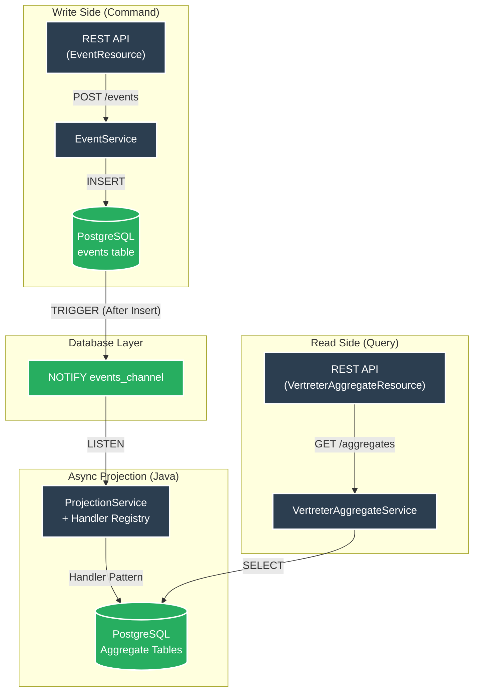

# es-psql-quarkus


**High-Performance Event Sourcing Template** mit Quarkus, CloudEvents und **reiner Java-basierter asynchroner Projection** via PostgreSQL LISTEN/NOTIFY (CQRS).

## Architektur (aktuell – nach Refactoring)



**Wichtig:** Die gesamte Aggregationslogik liegt **in Java** (Handler-Pattern). SQL-Triggers werden nur noch für NOTIFY verwendet.

## Voraussetzungen

- [Devbox](https://www.jetify.com/devbox/docs/installing_devbox/) installiert

## Schnellstart

```bash
# Devbox-Shell aktivieren
devbox shell

# PostgreSQL starten und Datenbank erstellen
devbox run pg:create

# Quarkus im Dev-Modus starten
./mvnw quarkus:dev
```

API: http://localhost:8080  
Swagger UI: http://localhost:8080/q/swagger-ui

## API Endpoints

### Events
| Method | Path                  | Beschreibung                  |
|--------|-----------------------|-------------------------------|
| `POST` | `/events`             | CloudEvent speichern (idempotent) |
| `GET`  | `/events/{id}`        | Event abrufen                 |
| `GET`  | `/events/subject/{subject}` | Events nach Subject      |
| `GET`  | `/events/type/{type}` | Events nach Typ               |

### Vertreter Aggregates
| Method | Path                              | Beschreibung                     |
|--------|-----------------------------------|----------------------------------|
| `GET`  | `/aggregates/vertreter`           | Alle Vertreter                   |
| `GET`  | `/aggregates/vertreter/{id}`      | Vertreter nach ID                |
| `GET`  | `/aggregates/vertreter/email/{email}` | Vertreter nach Email         |
| `GET`  | `/aggregates/vertreter/count`     | Anzahl Vertreter                 |
| `GET`  | `/aggregates/vertreter/vertretene-person/{id}` | Vertreter einer Person |

### Admin (neu)
| Method | Path                     | Beschreibung                     |
|--------|--------------------------|----------------------------------|
| `POST` | `/admin/projection/trigger` | Projection manuell triggern   |
| `POST` | `/admin/replay`          | Replay (optional `?fromEventId=UUID`) |

## Architektur-Komponenten

1. **Event Ingestion** – Idempotente Speicherung von CloudEvents
2. **Notification** – Minimaler PostgreSQL NOTIFY-Trigger
3. **Projection** – `ProjectionService` mit generischer Handler-Registry (skalierbar)
4. **Read Model** – Optimierte Aggregate-Tabellen (implementieren `AggregateRoot`)

## Features

- Near-Realtime Updates durch LISTEN/NOTIFY
- Vollständige Revisionssicherheit (unveränderlicher Event-Log)
- Write/Read-Separation (CQRS)
- Handler-Pattern für einfache Erweiterbarkeit
- Replay-Fähigkeit (kompletter Neuaufbau des Read-Models)
- Micrometer-Metriken (Projection-Lag, Errors, Processed-Events)
- Umfassende Test-Suite (60+ Tests für Edge-Cases, Handler & Replay) + k6-Loadtests
- Devbox-Komplettumgebung

## Erweiterung um neue Event-Typen / Aggregate (neu & generisch)

**Schritt 1:** Aggregate Entity erstellen (muss `AggregateRoot` implementieren)

**Schritt 2:** Neuen Handler erstellen
```java
@ApplicationScoped
@HandlesEvents(value = "space.maatini.abwesenheit.", aggregate = AbwesenheitAggregate.class)
public class AbwesenheitHandler implements AggregateEventHandler<AbwesenheitAggregate> {
    @Override
    public boolean canHandle(String eventType) {
        return eventType.startsWith("space.maatini.abwesenheit.");
    }

    @Override
    public Uni<Void> handle(CloudEvent event) { ... }
}
```

**Schritt 3:** DTO, Service und Resource hinzufügen (optional)
**Fertig.** Die `ProjectionService` registriert den neuen Handler automatisch.

## Tests & Benchmarks

```bash
# Tests
./mvnw test

# Load-Test (k6)
devbox run k6 run benchmarks/load-test.js
```

### Performance (M1 Max Local)

| Metrik | Ergebnis |
|--------|----------|
| **Throughput** | ~153 req/s |
| **P95 Latency** | 9.37 ms |
| **Error Rate** | 0% |
| **VUs** | 20 |

*Messung auf Apple M1 Max (32GB RAM), Local Dev Environment.*

## Devbox Befehle

| Befehl                    | Beschreibung                          |
|---------------------------|---------------------------------------|
| `devbox run pg:start`     | PostgreSQL starten                    |
| `devbox run pg:create`    | Datenbank erstellen                   |
| `devbox run quarkus:dev`  | App im Dev-Modus starten              |

## Production Readiness

- Replay-Endpoint für Recovery
- Metriken (Prometheus)
- Dead-Letter-Markierung bei Fehlern
- Multi-Instance-fähig (durch DB-Locking erweiterbar)
- Native Executable unterstützt

---

**Lizenz:** MIT  
**Copyright:** 2026 Martin Richardt


