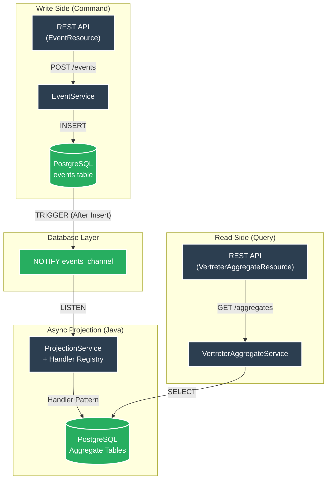

# es-psql-quarkus


**High-Performance Event Sourcing Template** mit Quarkus, CloudEvents und **reiner Java-basierter asynchroner Projection** via PostgreSQL LISTEN/NOTIFY (CQRS).

## Architektur (aktuell – nach Refactoring)



**Wichtig:** Die gesamte Aggregationslogik liegt **in Java** (Handler-Pattern). SQL-Triggers werden nur noch für NOTIFY verwendet.

## Voraussetzungen

- [Devbox](https://www.jetify.com/devbox/docs/installing_devbox/) installiert

## Schnellstart

```bash
# Devbox-Shell aktivieren
devbox shell

# PostgreSQL starten und Datenbank erstellen
devbox run pg:create

# Quarkus im Dev-Modus starten
./mvnw quarkus:dev
```

API: http://localhost:8080  
Swagger UI: http://localhost:8080/q/swagger-ui

## API Endpoints

### Events
| Method | Path                  | Beschreibung                  |
|--------|-----------------------|-------------------------------|
| `POST` | `/events`             | CloudEvent speichern (idempotent) |
| `GET`  | `/events/{id}`        | Event abrufen                 |
| `GET`  | `/events/subject/{subject}` | Events nach Subject      |
| `GET`  | `/events/type/{type}` | Events nach Typ               |

### Vertreter Aggregates
| Method | Path                              | Beschreibung                     |
|--------|-----------------------------------|----------------------------------|
| `GET`  | `/aggregates/vertreter`           | Alle Vertreter                   |
| `GET`  | `/aggregates/vertreter/{id}`      | Vertreter nach ID                |
| `GET`  | `/aggregates/vertreter/email/{email}` | Vertreter nach Email         |
| `GET`  | `/aggregates/vertreter/count`     | Anzahl Vertreter                 |
| `GET`  | `/aggregates/vertreter/vertretene-person/{id}` | Vertreter einer Person |

### Admin & Ops
| Method | Path                       | Beschreibung                     |
|--------|----------------------------|----------------------------------|
| `POST` | `/admin/projection/trigger` | Projection manuell triggern      |
| `POST` | `/admin/replay`             | Replay (optional `?fromEventId=UUID`) |
| `GET`  | `/q/health`                 | Health Status (ink. Projection-Lag) |
| `GET`  | `/q/metrics`                | Prometheus Metriken              |

## Architektur-Komponenten

1. **Event Ingestion** – Idempotente Speicherung von CloudEvents
2. **Notification** – Minimaler PostgreSQL NOTIFY-Trigger
3. **Projection** – `ProjectionService` mit generischer Handler-Registry (skalierbar)
4. **Read Model** – Optimierte Aggregate-Tabellen (implementieren `AggregateRoot`)

## Features

- Near-Realtime Updates durch LISTEN/NOTIFY
- Vollständige Revisionssicherheit (unveränderlicher Event-Log)
- Write/Read-Separation (CQRS)
- Handler-Pattern für einfache Erweiterbarkeit
- Replay-Fähigkeit (kompletter Neuaufbau des Read-Models)
- **Robustes Error Handling**: Automatischer Retry & Dead-Letter-Logik (v1.1)
- **Monitoring**: Micrometer-Prometheus Metriken & Custom HealthChecks (v1.1)
- **Multi-Instance-Sicherheit**: `FOR UPDATE SKIP LOCKED` für skalierbare Projektionen (v1.1)
- Umfassende Test-Suite (60+ Tests für Edge-Cases, Handler & Replay) + k6-Loadtests
- Devbox-Komplettumgebung

## Erweiterung um neue Event-Typen / Aggregate

Wenn du ein neues Thema (Aggregate) hinzufügen möchtest (z.B. "Abwesenheiten"), folge diesen drei einfachen Schritten:

### Schritt 1: Das Read-Model erstellen (Die Datenbank-Tabelle)

Erstelle eine Java-Klasse für dein neues Aggregat. Diese Klasse stellt den aktuellen Zustand in der Datenbank dar.

1.  **Pfad:** `src/main/java/space/maatini/eventsourcing/entity/`
2.  **Anforderungen:** 
    - Nutze `@Entity` und `@Table`.
    - Erweitere `PanacheEntityBase` (für einfachen DB-Zugriff).
    - Implementiere das Interface `AggregateRoot`.
3.  **Wichtige Felder:** Dein Aggregat braucht zwingend `eventId`, `version` und `updatedAt`, damit das System weiß, auf welchem Stand die Daten sind.

**Beispiel:**
```java
@Entity
@Table(name = "abwesenheit_aggregate")
public class AbwesenheitAggregate extends PanacheEntityBase implements AggregateRoot {
    @Id
    public String id;
    public String grund;
    
    // Pflichtfelder für das Event-Sourcing
    public UUID eventId;
    public Integer version;
    public OffsetDateTime updatedAt;
}
```

### Schritt 2: Den Handler erstellen (Die Logik)

Der Handler entscheidet, was passiert, wenn ein neues Event eintrifft. Er liest das Event und aktualisiert die Tabelle aus Schritt 1.

1.  **Pfad:** `src/main/java/space/maatini/eventsourcing/service/`
2.  **Anforderungen:**
    - Nutze `@ApplicationScoped`.
    - Nutze `@HandlesEvents` um zu definieren, auf welche Events (Präfix) dieser Handler reagiert.
    - Implementiere `AggregateEventHandler<DeinAggregat>`.

**Beispiel:**
```java
@ApplicationScoped
@HandlesEvents(value = "space.maatini.abwesenheit.", aggregate = AbwesenheitAggregate.class)
public class AbwesenheitHandler implements AggregateEventHandler<AbwesenheitAggregate> {

    @Override
    public boolean canHandle(String eventType) {
        // Reagiere z.B. auf "created" und "updated"
        return eventType.startsWith("space.maatini.abwesenheit.");
    }

    @Override
    public Uni<Void> handle(CloudEvent event) {
        JsonObject data = event.getData();
        String id = data.getString("id");

        // 1. Bestehendes Aggregat suchen oder neues erstellen
        return AbwesenheitAggregate.<AbwesenheitAggregate>findById(id)
            .chain(existing -> {
                AbwesenheitAggregate agg = existing != null ? existing : new AbwesenheitAggregate();
                agg.id = id;
                
                // 2. Daten aus dem Event übernehmen
                agg.grund = data.getString("grund");
                
                // 3. Metadaten setzen (Pflicht)
                agg.updatedAt = event.getTime();
                agg.eventId = event.getId();
                agg.version = (agg.version == null ? 0 : agg.version) + 1;

                // 4. Speichern
                return agg.persist();
            }).replaceWithVoid();
    }
}
```

### Schritt 3: API & Service (Die Abfrage)

Damit du die Daten auch wieder auslesen kannst, erstellst du wie gewohnt eine Resource (REST-Schnittstelle).

1.  **Service:** Erstelle einen Service, der die Daten aus der `abwesenheit_aggregate` Tabelle abfragt.
2.  **Resource:** Erstelle einen Controller, der z.B. unter `/aggregates/abwesenheit` erreichbar ist.

**Das war's!** Der `ProjectionService` erkennt deinen neuen Handler automatisch beim Start der Anwendung. Du musst nichts manuell registrieren.

## Tests & Benchmarks

```bash
# Tests
./mvnw test

# Load-Test (k6)
devbox run k6 run benchmarks/load-test.js
```

### Performance (M1 Max Local)

| Metrik | Ergebnis |
|--------|----------|
| **Throughput** | ~153 req/s |
| **P95 Latency** | 9.37 ms |
| **Error Rate** | 0% |
| **VUs** | 20 |

*Messung auf Apple M1 Max (32GB RAM), Local Dev Environment.*

## Devbox Befehle

| Befehl                    | Beschreibung                          |
|---------------------------|---------------------------------------|
| `devbox run pg:start`     | PostgreSQL starten                    |
| `devbox run pg:create`    | Datenbank erstellen                   |
| `devbox run quarkus:dev`  | App im Dev-Modus starten              |

## Production Readiness

- Replay-Endpoint für Recovery
- Metriken (Prometheus)
- Dead-Letter-Markierung bei Fehlern
- Multi-Instance-fähig (durch DB-Locking erweiterbar)
- Native Executable unterstützt

---

**Lizenz:** MIT  
**Copyright:** 2026 Martin Richardt


