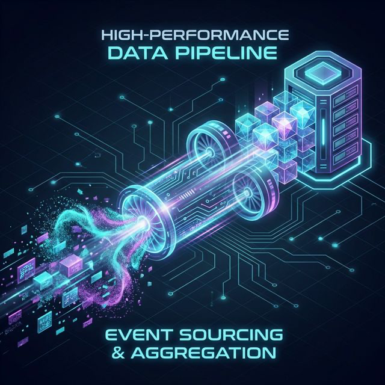
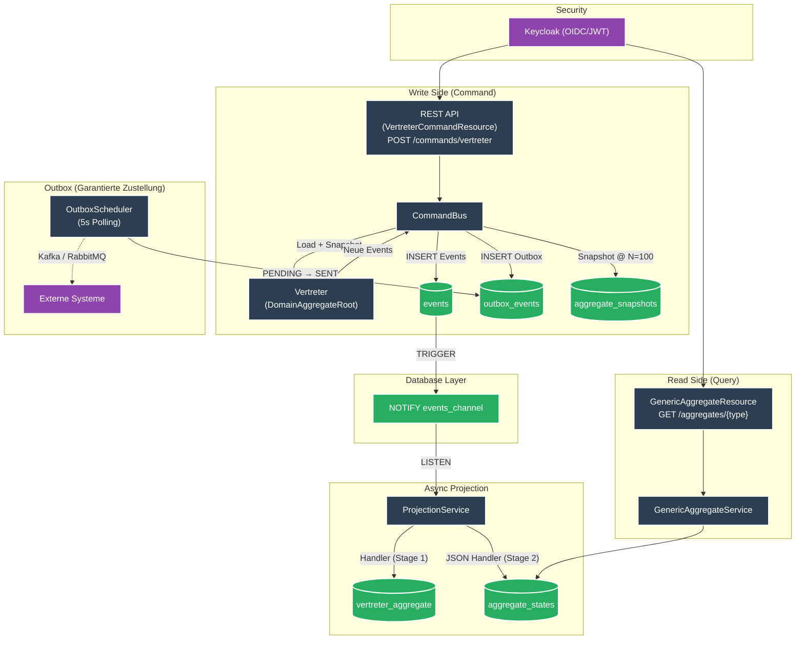

# es-psql-quarkus




**High-Performance Event Sourcing Framework v2.0** mit Quarkus 3.31, CloudEvents und vollständigem **CQRS-Muster** via PostgreSQL LISTEN/NOTIFY.

## Architektur



**Kernprinzipien:**
- **Generic CommandBus** routet Commands an registrierte `CommandHandler` via `@HandlesCommand`
- **Aggregate Snapshots** reduzieren Replay-Overhead (automatisch alle 100 Versionen)
- **Transactional Outbox Pattern** garantiert zuverlässige Event-Zustellung
- **OIDC/JWT Security** via Keycloak mit `@RolesAllowed`-Absicherung
- **Dual-Mode Read-Model**: klassische Tabellen (Stufe 1) und generisches JSONB (Stufe 2)
- **Event Versioning** über `dataVersion` für sichere Schema-Evolution

## Voraussetzungen

- [Devbox](https://www.jetify.com/devbox/docs/installing_devbox/) installiert

## Schnellstart

```bash
# Devbox-Shell aktivieren
devbox shell

# PostgreSQL starten und Datenbank erstellen
devbox run pg:create

# Quarkus im Dev-Modus starten
devbox run quarkus:dev
```

API: http://localhost:8080  
Swagger UI: http://localhost:8080/q/swagger-ui

## API Endpoints

### Commands (Write Side – mit Invariant-Prüfung)
| Method   | Path                       | Beschreibung                              |
|----------|----------------------------|-------------------------------------------|
| `POST`   | `/commands/vertreter`      | Vertreter anlegen (Duplikat → 400)        |
| `PUT`    | `/commands/vertreter/{id}` | Vertreter aktualisieren (nicht existent → 400) |
| `DELETE` | `/commands/vertreter/{id}` | Vertreter löschen                         |

### Events (Low-Level Write)
| Method | Path                        | Beschreibung                       |
|--------|-----------------------------|------------------------------------|
| `POST` | `/events`                   | CloudEvent speichern (idempotent)  |
| `GET`  | `/events/{id}`              | Event abrufen                      |
| `GET`  | `/events/subject/{subject}` | Events nach Subject                |
| `GET`  | `/events/type/{type}`       | Events nach Typ                    |

### Generic Aggregates (Stage 2 – JSON-basiert)
| Method | Path                         | Beschreibung                       |
|--------|------------------------------|------------------------------------|
| `GET`  | `/aggregates/{type}`         | Alle Aggregate eines Typs          |
| `GET`  | `/aggregates/{type}/{id}`    | Aggregat nach ID                   |

### Vertreter Aggregates (Stage 1 – Tabellen-basiert)
| Method | Path                                           | Beschreibung                  |
|--------|------------------------------------------------|-------------------------------|
| `GET`  | `/aggregates/vertreter`                        | Alle Vertreter                |
| `GET`  | `/aggregates/vertreter/{id}`                   | Vertreter nach ID             |
| `GET`  | `/aggregates/vertreter/email/{email}`          | Vertreter nach E-Mail         |
| `GET`  | `/aggregates/vertreter/count`                  | Anzahl Vertreter              |
| `GET`  | `/aggregates/vertreter/vertretene-person/{id}` | Vertreter einer Person        |

### Admin & Ops
| Method | Path                        | Beschreibung                              |
|--------|-----------------------------|-------------------------------------------|
| `POST` | `/admin/projection/trigger` | Projection manuell triggern               |
| `POST` | `/admin/replay`             | Replay (optional `?fromEventId=UUID`)     |
| `GET`  | `/q/health`                 | Health Status (inkl. Projection-Lag)      |
| `GET`  | `/q/metrics`                | Prometheus Metriken                       |

## Features

- **Generic CommandBus** mit `@HandlesCommand`-Annotation für Zero-Boilerplate Command Routing
- **Aggregate Snapshotting** – Replay-Optimierung ab 100 Events
- **Transactional Outbox Pattern** – garantierte Event-Zustellung mit `OutboxScheduler`
- **Event Versioning** über `dataVersion` für Schema-Evolution
- **OIDC/JWT Security** via Keycloak mit `@RolesAllowed`
- **True CQRS** – Command-Side mit DomainAggregateRoot und Invariant-Prüfung
- Near-Realtime Updates durch PostgreSQL LISTEN/NOTIFY
- **Vollständig generisches JSON-basiertes Read-Model (Stufe 2)**
- Vollständige Revisionssicherheit (unveränderlicher Event-Log)
- Replay-Fähigkeit (kompletter Neuaufbau beider Read-Models)
- **Robustes Error Handling**: Automatischer Retry & Dead-Letter-Logik
- **Monitoring**: Micrometer/Prometheus + Custom HealthChecks
- **Docker Compose** + **Kubernetes-Manifeste** für Production-Deployments
- Umfassende Test-Suite (45 Tests) mit `@TestProfile` und `@TestSecurity`
- Devbox-Komplettumgebung

## Paketstruktur

```
src/main/java/space/maatini/eventsourcing/
├── command/                  # Generic Command Routing
│   ├── CommandBus.java       # Zentraler Dispatcher (Load/Handle/Save)
│   ├── CommandHandler.java   # Handler-Interface
│   └── HandlesCommand.java   # Annotation für Handler-Discovery
├── domain/
│   └── DomainAggregateRoot.java # Basis: emitEvent(), takeSnapshot(), restoreSnapshot()
├── dto/
├── entity/
│   ├── AggregateRoot.java       # Marker-Interface (JPA)
│   ├── AggregateSnapshot.java   # Snapshot-Persistenz
│   ├── CloudEvent.java          # Event-Store (+ dataVersion)
│   ├── JsonAggregate.java       # Generisches JSON-Read-Model (Stufe 2)
│   └── OutboxEvent.java         # Transactional Outbox
├── resource/                    # REST-Endpunkte (@RolesAllowed)
├── service/
│   ├── AggregateSnapshotService.java  # Snapshot CRUD
│   ├── OutboxScheduler.java           # 5s Poller (PENDING→SENT)
│   ├── ProjectionService.java
│   └── EventHandlerRegistry.java
└── example/vertreter/               # Beispiel-Implementierung
    ├── domain/Vertreter.java        # Aggregate (emitEvent)
    ├── dto/command/                 # Command DTOs
    ├── resource/                    # @RolesAllowed("user")
    └── service/                     # @HandlesCommand Handler
```

## 🚀 Eigene Features entwickeln (Schritt-für-Schritt)

Dieses Template nutzt CQRS – das bedeutet, das **Schreiben von Daten (Commands)** und das **Lesen von Daten (Queries/Projections)** ist strikt getrennt. 
Hier ist ein komplettes Tutorial, wie du ein neues Feature (z.B. ein Fahrzeug) hinzufügst.

### Schritt 1: Domain-Aggregat erstellen
Das Aggregat ist der Wächter deiner Geschäftslogik. Nutze `emitEvent()` für saubere Event-Erzeugung.

```java
package space.maatini.eventsourcing.example.fahrzeug.domain;

import space.maatini.eventsourcing.domain.DomainAggregateRoot;
import space.maatini.eventsourcing.entity.CloudEvent;
import io.vertx.core.json.JsonObject;

public class Fahrzeug extends DomainAggregateRoot {
    private boolean registered = false;

    public Fahrzeug(String id) { super(id); }

    public void register(String marke, String kennzeichen) {
        if (registered) throw new IllegalStateException("Bereits registriert!");
        emitEvent("space.maatini.fahrzeug.registered",
                  new JsonObject().put("id", getId()).put("marke", marke).put("kennzeichen", kennzeichen));
    }

    @Override
    protected void mutate(CloudEvent event) {
        if (event.getType().endsWith(".registered")) this.registered = true;
    }
}
```

### Schritt 2: Command Handler erstellen
Kein manuelles Aggregate-Loading mehr – der `CommandBus` übernimmt alles.

```java
package space.maatini.eventsourcing.example.fahrzeug.service;

import jakarta.enterprise.context.ApplicationScoped;
import io.smallrye.mutiny.Uni;
import space.maatini.eventsourcing.command.*;
import space.maatini.eventsourcing.example.fahrzeug.domain.Fahrzeug;

public record RegisterFahrzeugCommand(String id, String marke, String kennzeichen) {}

@ApplicationScoped
@HandlesCommand(RegisterFahrzeugCommand.class)
public class RegisterFahrzeugHandler implements CommandHandler<Fahrzeug, RegisterFahrzeugCommand> {
    @Override
    public Uni<Fahrzeug> handle(Fahrzeug fahrzeug, RegisterFahrzeugCommand cmd) {
        fahrzeug.register(cmd.marke(), cmd.kennzeichen());
        return Uni.createFrom().item(fahrzeug);
    }
}
```

### Schritt 3: REST Resource + CommandBus

```java
@Path("/commands/fahrzeuge")
@RolesAllowed("user")
public class FahrzeugCommandResource {
    @Inject CommandBus commandBus;

    @POST
    public Uni<Response> register(RegisterFahrzeugCommand cmd) {
        return commandBus.dispatch(cmd.id(), Fahrzeug.class, cmd)
                .replaceWith(Response.status(201).build());
    }
}
```

### Schritt 4: Read-Model bereitstellen (Stufe 2)
Damit du die erzeugten Fahrzeuge effizient lesen kannst, schreiben wir einen asynchronen Projektor. 
Dank des **Generic JSON Read-Models** benötigst du **keine** SQL-Migrationen, **keine** Entity-Klassen und **keine** eigenen Read-APIs!

```java
package space.maatini.eventsourcing.example.fahrzeug.service;

import jakarta.enterprise.context.ApplicationScoped;
import io.vertx.core.json.JsonObject;
import space.maatini.eventsourcing.entity.CloudEvent;
import space.maatini.eventsourcing.service.JsonAggregateHandler;
import space.maatini.eventsourcing.service.HandlesEvents;

@ApplicationScoped
@HandlesEvents(value = "space.maatini.fahrzeug.", aggregateType = "fahrzeug")
public class FahrzeugJsonHandler implements JsonAggregateHandler {

    @Override
    public String getAggregateType() {
        return "fahrzeug"; // Unter /aggregates/fahrzeug abrufbar
    }

    @Override
    public JsonObject apply(JsonObject state, CloudEvent event) {
        JsonObject newState = state.copy();
        
        if (event.getType().endsWith(".registered")) {
            JsonObject data = event.getData();
            newState.put("id", data.getString("id"));
            newState.put("marke", data.getString("marke"));
            newState.put("kennzeichen", data.getString("kennzeichen"));
            // Hier könntest du Metadaten etc. anreichern
        }
        
        return newState;
    }
}
```

**Das war's! 🎉** 
Sobald ein Fahrzeug über `POST /commands/fahrzeuge` registriert wurde, feuert der PostgreSQL-Trigger, die Anwendung verarbeitet das Event asynchron und das fertige Fahrzeug ist **sofort** über die generische API abrufbar:
`GET /aggregates/fahrzeug/{id}`

## Tests

```bash
# Unit + Integrationstests
./mvnw test

# Load-Test (k6)
devbox run k6 run benchmarks/load-test.js
```

### Performance (Linux Devbox – aktuelle Messung 21.02.2026)

| Metrik | Ergebnis |
|--------|----------|
| **Iterationen** | 14.687 (in 100 s) |
| **Throughput** | ~146 Iterationen/s |
| **HTTP-Requests gesamt** | 44.054 (∼440 req/s) |
| **P90 Latency** | 6.47 ms |
| **P95 Latency** | 7.7 ms ✅ (Threshold: < 100 ms) |
| **P95 Latency (nur 2xx)** | 5.8 ms |
| **Business Error Rate** | 0% |
| **VUs** | 20 |

> **Hinweis zur Poll-Rate (~33% HTTP-Fails):** Der Load-Test pollt `GET /aggregates` nach jedem
> `POST /events` bis die Projektion fertig ist (Eventual Consistency). Diese 404-Antworten
> sind kein Fehler — Business-Error-Rate = **0%**.

*Messung auf Linux x86-64 (Devbox), PostgreSQL lokal.*

## Devbox Befehle

| Befehl                   | Beschreibung            |
|--------------------------|-------------------------|
| `devbox run pg:start`    | PostgreSQL starten      |
| `devbox run pg:create`   | Datenbank erstellen     |
| `devbox run quarkus:dev` | App im Dev-Modus        |

## Production Readiness

- Replay-Endpoint für Recovery
- Prometheus-Metriken & Custom Health Check (inkl. Projection-Lag)
- Dead-Letter-Queue bei permanenten Fehlern
- Multi-Instance-fähig (`FOR UPDATE SKIP LOCKED`)
- Native Executable unterstützt (GraalVM)
- `UNIQUE` + optimistic Locking schützen vor Race Conditions

## Deployment

### Docker Compose
```bash
# Build + Start (PostgreSQL + Keycloak + App)
./mvnw package -DskipTests
docker compose up --build
```

### Kubernetes
```bash
kubectl apply -f k8s/
```

---

**Lizenz:** MIT  
**Copyright:** 2026 Martin Richardt
