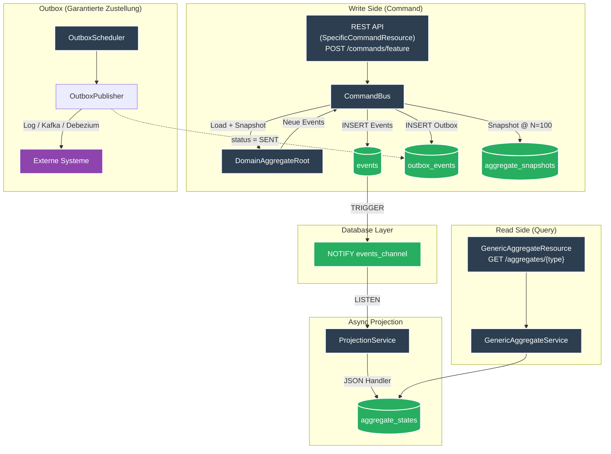

# es-psql-quarkus


**High-Performance Event Sourcing Framework v2.1** mit Quarkus 3.x, CloudEvents und vollständigem **CQRS-Muster** via PostgreSQL LISTEN/NOTIFY.


## Architektur



**Kernprinzipien:**
- **Generic CommandBus** routet Commands an registrierte `CommandHandler` via `@HandlesCommand`
- **JSON Schema Validation** via `dataschema` Header für garantierte Datenqualität
- **Aggregate Snapshots** reduzieren Replay-Overhead (automatisch alle 100 Versionen)
- **Optimistic Concurrency Control** via `aggregate_version` und DB-Unique-Constraint
- **Functional Outbox** mit erweiterbarem `OutboxPublisher` und optionaler Debezium-Unterstützung
- **Event Versioning** über `dataVersion` für sichere Schema-Evolution

## Voraussetzungen

- [Devbox](https://www.jetify.com/devbox/docs/installing_devbox/) installiert

## Schnellstart

```bash
# Devbox-Shell aktivieren
devbox shell

# PostgreSQL starten und Datenbank erstellen
devbox run pg:create

# Quarkus im Dev-Modus starten
devbox run quarkus:dev
```

API: http://localhost:8080  
Swagger UI: http://localhost:8080/q/swagger-ui

## API Endpoints

### Events (Low-Level Write & Store)
| Method | Path                        | Beschreibung                       |
|--------|-----------------------------|------------------------------------|
| `POST` | `/events`                   | CloudEvent speichern (idempotent, inkl. Schema-Validierung) |
| `GET`  | `/events/{id}`              | Event abrufen                      |
| `GET`  | `/events/subject/{subject}` | Events nach Subject                |
| `GET`  | `/events/type/{type}`       | Events nach Typ                    |

### Generic Aggregates (Read-Model – JSON-basiert)
| Method | Path                         | Beschreibung                       |
|--------|------------------------------|------------------------------------|
| `GET`  | `/aggregates/{type}`         | Alle Aggregate eines Typs          |
| `GET`  | `/aggregates/{type}/{id}`    | Aggregat nach ID (State der Projektion) |

### Admin & Ops
| Method | Path                        | Beschreibung                              |
|--------|-----------------------------|-------------------------------------------|
| `POST` | `/admin/projection/trigger` | Projektionen manuell für alle Events triggern |
| `POST` | `/admin/replay`             | Replay des Event-Logs (optional `?fromEventId=UUID`) |
| `GET`  | `/q/health`                 | Health Status (inkl. Liveness, Readiness und Projection-Lag) |
| `GET`  | `/q/metrics`                | Prometheus / MicroProfile Metriken        |

## Features

- **Generic CommandBus** mit `@HandlesCommand`-Annotation für Zero-Boilerplate Command Routing
- **JSON Schema Validation** – Einhaltung von Payload-Strukturen via CloudEvent `dataschema`
- **Aggregate Snapshotting** – Performance-Optimierung durch Speicherung des State-Snapshots (default alle 100 Events)
- **Transactional Outbox Pattern** – garantierte Event-Zustellung zu externen Systemen
- **Debezium CDC Unterstützung** – optionales Streaming der Outbox via Kafka Connect
- **Event Versioning** via `dataVersion` für reibungslose Schema-Evolution
- **Optimistic Concurrency Control** – DB-Level Schutz vor Race-Conditions (HTTP 409 Conflict)
- **True CQRS** – Strikte Trennung von Command-Logik und generischer Read-Side
- **Vollständig generisches JSON-Read-Model** – Projektionen ohne SQL-Migrationen oder Boilerplate-Entities
- **High Observability** – Inklusive Health-Checks (mit Lag-Metric) und Prometheus Export
- **Low Footprint** – Optimiert für Quarkus und PostgreSQL Reactive
- Umfassende Test-Suite (46+ Tests) mit `@TestProfile`
- Devbox-Support für deterministische Entwicklungsumgebungen

## Paketstruktur

```
```
src/main/java/space/maatini/eventsourcing/
├── command/                  # Command Side & Routing
│   ├── CommandBus.java       # Zentraler Dispatcher
│   ├── CommandHandler.java   # Handler Interface
│   └── HandlesCommand.java   # Discovery Annotation
├── domain/                   # Domain Logic
│   └── DomainAggregateRoot.java # Basis für State & Event Emission
├── dto/                      # Data Transfer Objects (CloudEvents)
├── entity/                   # JPA Entities (Event Store, Snapshots, Outbox)
├── exception/                # Framework Exceptions (e.g. Concurrency, Validation)
├── resource/                 # REST Resources (Framework Core APIs)
└── service/                  # Core Logic (Projection, Snapshotting, Outbox)
````

## 🚀 Eigene Features entwickeln (Schritt-für-Schritt)

Das Framework ist generisch. Du bringst lediglich deine Domänen-Logik und Projektions-Regeln mit.
Hier ist ein Beispiel, wie du ein neues Feature (z.B. ein Fahrzeug) hinzufügst.

### Schritt 1: JSON-Schema definieren (Best Practice)
Platziere ein Schema in `src/main/resources/schemas/space.maatini.fahrzeug.registered.json`. Das stellt sicher, dass nur valide Daten im Event-Store landen.

```json
{
  "type": "object",
  "properties": {
    "id": { "type": "string" },
    "marke": { "type": "string", "minLength": 2 },
    "kennzeichen": { "type": "string" }
  },
  "required": ["id", "marke"]
}
```

### Schritt 2: Domain-Aggregat erstellen
Das Aggregat ist der Wächter deiner Geschäftslogik. Nutze `emitEvent()` für saubere Zustandsübergänge.

```java
public class Fahrzeug extends DomainAggregateRoot {
    private boolean registered = false;

    public Fahrzeug(String id) { super(id); }

    public void register(String marke, String kennzeichen) {
        if (registered) throw new IllegalStateException("Bereits registriert!");
        // Emit mit dataschema Verweis zur automatischen Validierung
        emitEvent("space.maatini.fahrzeug.registered",
                  new JsonObject().put("id", getId()).put("marke", marke).put("kennzeichen", kennzeichen),
                  "space.maatini.fahrzeug.registered.json");
    }

    @Override
    protected void mutate(CloudEvent event) {
        if (event.getType().endsWith(".registered")) this.registered = true;
    }
}
```

### Schritt 3: Command Handler & Resource
Nutze den generischen `CommandBus` für das Laden und Speichern der Aggregate.

```java
@ApplicationScoped
@HandlesCommand(RegisterFahrzeugCommand.class)
public class RegisterFahrzeugHandler implements CommandHandler<Fahrzeug, RegisterFahrzeugCommand> {
    @Override
    public Uni<Fahrzeug> handle(Fahrzeug fahrzeug, RegisterFahrzeugCommand cmd) {
        fahrzeug.register(cmd.marke(), cmd.kennzeichen());
        return Uni.createFrom().item(fahrzeug);
    }
}
```

### Schritt 4: Read-Model (Projektion)
Dank des **Generic JSON Read-Models** benötigst du keine eigenen SQL-Tabellen. Der Zustand ist sofort über die generische API abrufbar.

```java
@ApplicationScoped
@HandlesEvents(value = "space.maatini.fahrzeug.", aggregateType = "fahrzeug")
public class FahrzeugJsonHandler implements JsonAggregateHandler {
    @Override
    public JsonObject apply(JsonObject state, CloudEvent event) {
        JsonObject newState = state.copy();
        if (event.getType().endsWith(".registered")) {
            newState.mergeIn(event.getData());
        }
        return newState;
    }
}
```

**Das war's! 🎉**
Nach dem Command-Aufruf ist das Ergebnis sofort unter `GET /aggregates/fahrzeug/{id}` verfügbar.

## Tests

```bash
# Unit + Integrationstests
./mvnw test

# Load-Test (k6)
devbox run k6 run benchmarks/load-test.js
```

### Performance (Linux Devbox – aktuelle Messung 21.02.2026)

| Metrik | Ergebnis |
|--------|----------|
| **Tests Gesamt** | 46 ✅ |
| **Iterationen** | 18.574 (in 100 s) |
| **Throughput** | ~185 Iterationen/s |
| **HTTP-Requests gesamt** | 37.148 (∼371 req/s) |
| **P90 Latency (Gesamt)** | 57.63 ms |
| **P95 Latency (Gesamt)** | 68.1 ms ✅ |
| **P95 Latency (201/200 OKs)** | 75.75 ms ✅ |
| **VUs** | 20 |

> **Hinweis zur Poll-Rate (~90% HTTP-Fails):** Der Load-Test pollt `GET /events/{id}`
> nach `POST /events` sehr aggressiv. Diese 404-Antworten sind kein Fehler des
> Systems, sondern spiegeln die Eventual Consistency wider.

*Messung auf Linux x86-64 (Devbox), PostgreSQL lokal.*

## Devbox Befehle

| Befehl                   | Beschreibung            |
|--------------------------|-------------------------|
| `devbox run pg:start`    | PostgreSQL starten      |
| `devbox run pg:create`   | Datenbank erstellen     |
| `devbox run quarkus:dev` | App im Dev-Modus        |

## Production Readiness

- Replay-Endpoint für Recovery
- Prometheus-Metriken & Custom Health Check (inkl. Projection-Lag)
- Dead-Letter-Queue bei permanenten Fehlern
- Multi-Instance-fähig (`FOR UPDATE SKIP LOCKED`)
- Native Executable unterstützt (GraalVM)
- `UNIQUE` + optimistic Locking schützen vor Race Conditions

## Deployment

### Docker Compose (Standard)
```bash
# Build + Start (PostgreSQL + App)
./mvnw package -DskipTests
docker compose up --build
```

### Docker Compose (Debezium Change Data Capture)
```bash
# Build + Start (PostgreSQL, Zookeeper, Kafka, Kafka Connect & App)
./mvnw package -DskipTests
docker compose -f docker-compose.debezium.yml up --build

# In diesem Setup ist das interne Outbox-Polling der App deaktiviert 
# (EVENTSOURCING_OUTBOX_POLLING_ENABLED=false).
# An seiner Stelle kann Kafka Connect konfiguriert werden, 
# um die Tabelle outbox_events auszulesen.
```

### Kubernetes
```bash
kubectl apply -f k8s/
```

---

**Lizenz:** MIT  
**Copyright:** 2026 Martin Richardt
