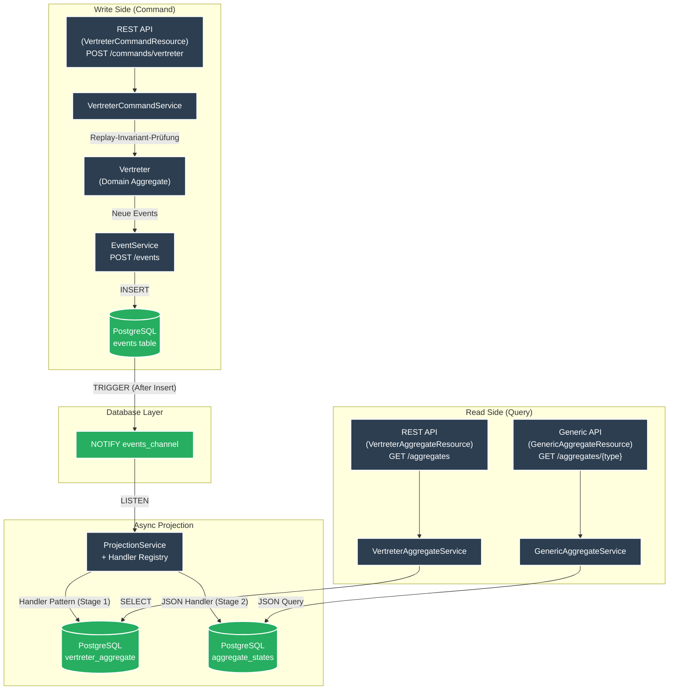

# es-psql-quarkus


**High-Performance Event Sourcing Template** mit Quarkus 3.31, CloudEvents und vollständigem **CQRS-Muster** via PostgreSQL LISTEN/NOTIFY.

## Architektur



**Kernprinzipien:**
- **Commands** prüfen Invarianten (Aggregate-Replay) bevor Events gespeichert werden
- **SQL-Triggers** nur noch für NOTIFY – die gesamte Aggregationslogik liegt in Java
- **Dual-Mode Read-Model**: Unterstützt sowohl klassische Tabellen (Stufe 1) als auch generisches JSONB (Stufe 2)
- **Optimistic Locking** via JPA `@Version` – verhindert Race Conditions

## Voraussetzungen

- [Devbox](https://www.jetify.com/devbox/docs/installing_devbox/) installiert

## Schnellstart

```bash
# Devbox-Shell aktivieren
devbox shell

# PostgreSQL starten und Datenbank erstellen
devbox run pg:create

# Quarkus im Dev-Modus starten
devbox run quarkus:dev
```

API: http://localhost:8080  
Swagger UI: http://localhost:8080/q/swagger-ui

## API Endpoints

### Commands (Write Side – mit Invariant-Prüfung)
| Method   | Path                       | Beschreibung                              |
|----------|----------------------------|-------------------------------------------|
| `POST`   | `/commands/vertreter`      | Vertreter anlegen (Duplikat → 400)        |
| `PUT`    | `/commands/vertreter/{id}` | Vertreter aktualisieren (nicht existent → 400) |
| `DELETE` | `/commands/vertreter/{id}` | Vertreter löschen                         |

### Events (Low-Level Write)
| Method | Path                        | Beschreibung                       |
|--------|-----------------------------|------------------------------------|
| `POST` | `/events`                   | CloudEvent speichern (idempotent)  |
| `GET`  | `/events/{id}`              | Event abrufen                      |
| `GET`  | `/events/subject/{subject}` | Events nach Subject                |
| `GET`  | `/events/type/{type}`       | Events nach Typ                    |

### Generic Aggregates (Stage 2 – JSON-basiert)
| Method | Path                         | Beschreibung                       |
|--------|------------------------------|------------------------------------|
| `GET`  | `/aggregates/{type}`         | Alle Aggregate eines Typs          |
| `GET`  | `/aggregates/{type}/{id}`    | Aggregat nach ID                   |

### Vertreter Aggregates (Stage 1 – Tabellen-basiert)
| Method | Path                                           | Beschreibung                  |
|--------|------------------------------------------------|-------------------------------|
| `GET`  | `/aggregates/vertreter`                        | Alle Vertreter                |
| `GET`  | `/aggregates/vertreter/{id}`                   | Vertreter nach ID             |
| `GET`  | `/aggregates/vertreter/email/{email}`          | Vertreter nach E-Mail         |
| `GET`  | `/aggregates/vertreter/count`                  | Anzahl Vertreter              |
| `GET`  | `/aggregates/vertreter/vertretene-person/{id}` | Vertreter einer Person        |

### Admin & Ops
| Method | Path                        | Beschreibung                              |
|--------|-----------------------------|-------------------------------------------|
| `POST` | `/admin/projection/trigger` | Projection manuell triggern               |
| `POST` | `/admin/replay`             | Replay (optional `?fromEventId=UUID`)     |
| `GET`  | `/q/health`                 | Health Status (inkl. Projection-Lag)      |
| `GET`  | `/q/metrics`                | Prometheus Metriken                       |

## Features

- **True CQRS** – Command-Side mit Domänen-Aggregaten und Invariant-Prüfung
- Near-Realtime Updates durch PostgreSQL LISTEN/NOTIFY
- **Vollständig generisches JSON-basiertes Read-Model (Stufe 2)**
- Vollständige Revisionssicherheit (unveränderlicher Event-Log)
- **Optimistic Locking** (JPA `@Version`) für Race Condition-Schutz
- **DB Constraints**: `UNIQUE(email)`, `CHECK (version >= 0)`
- Handler-Pattern für beliebig viele Aggregate
- Replay-Fähigkeit (kompletter Neuaufbau beider Read-Models)
- **Robustes Error Handling**: Automatischer Retry & Dead-Letter-Logik
- **Monitoring**: Micrometer/Prometheus + Custom HealthChecks
- Umfassende Test-Suite (72 Tests) – voll isoliert via `@BeforeEach`-DB-Wipe
- Devbox-Komplettumgebung

## Paketstruktur

```
src/main/java/space/maatini/eventsourcing/
├── domain/                   # Domänen-Aggregate (Invarianten, Schreib-Logik)
│   ├── AggregateRoot.java    # Basisklasse für Domain-Aggregate
│   └── Vertreter.java
├── dto/
│   └── command/              # Command-DTOs
│       ├── CreateVertreterCommand.java
│       ├── UpdateVertreterCommand.java
│       └── VertretenePersonCommandDTO.java
├── entity/                   # JPA Read-Models (Projektions-Tabellen)
│   ├── AggregateRoot.java    # Marker-Interface für Entitäten
│   ├── JsonAggregate.java    # Generisches JSON-Read-Model (Stufe 2)
│   ├── CloudEvent.java
│   └── VertreterAggregate.java
├── resource/                 # REST-Endpunkte
│   ├── GenericAggregateResource.java # Generische API (Stufe 2)
│   ├── VertreterCommandResource.java
│   ├── VertreterAggregateResource.java
│   ├── EventResource.java
│   └── AdminResource.java
└── service/                  # Applikationslogik & Handler
    ├── JsonAggregateHandler.java # Basis für generische Handler (Stufe 2)
    ├── VertreterJsonHandler.java # Beispiel generischer Handler
    ├── VertreterCommandService.java
    ├── VertreterCreatedOrUpdatedHandler.java # Stufe 1 Handler
    ├── VertreterDeletedHandler.java
    ├── ProjectionService.java          # Facade
    ├── EventBatchProcessor.java
    ├── EventHandlerRegistry.java
    ├── ProjectionReplayService.java
    └── EventNotificationListener.java  # PG LISTEN (deaktiviert im Test-Profil)
```

## Neues Aggregat hinzufügen (Stufe 2 - Generisch)

Dies ist der empfohlene Weg, da er **keine Datenbank-Migrationen**, **keine JPA-Entitäten** und **keine neuen REST-Resourcen** erfordert.

### Schritt 1: Handler schreiben

```java
@ApplicationScoped
@HandlesEvents(value = "space.maatini.abwesenheit.", aggregateType = "abwesenheit")
public class AbwesenheitJsonHandler implements JsonAggregateHandler {
    @Override public String getAggregateType() { return "abwesenheit"; }

    @Override public JsonObject apply(JsonObject state, CloudEvent event) {
        JsonObject data = event.getData();
        JsonObject newState = state.copy();
        
        if (event.getType().endsWith(".created")) {
            newState.put("id", data.getString("id"));
            newState.put("grund", data.getString("grund"));
        }
        return newState;
    }
}
```

### Schritt 2: Domain-Aggregat (Command Layer)

```java
public class Abwesenheit extends space.maatini.eventsourcing.domain.AggregateRoot {
    public Abwesenheit(String id) { super(id); }
    // Invariant-Prüfung und Event-Erzeugung...
}
```

**Das war's.** Das Aggregat ist sofort unter `/aggregates/abwesenheit/{id}` abrufbar.

## Tests

```bash
# Unit + Integrationstests
./mvnw test

# Load-Test (k6)
devbox run k6 run benchmarks/load-test.js
```

### Performance (Linux Devbox – aktuelle Messung 21.02.2026)

| Metrik | Ergebnis |
|--------|----------|
| **Iterationen** | 14.687 (in 100 s) |
| **Throughput** | ~146 Iterationen/s |
| **HTTP-Requests gesamt** | 44.054 (∼440 req/s) |
| **P90 Latency** | 6.47 ms |
| **P95 Latency** | 7.7 ms ✅ (Threshold: < 100 ms) |
| **P95 Latency (nur 2xx)** | 5.8 ms |
| **Business Error Rate** | 0% |
| **VUs** | 20 |

> **Hinweis zur Poll-Rate (~33% HTTP-Fails):** Der Load-Test pollt `GET /aggregates` nach jedem
> `POST /events` bis die Projektion fertig ist (Eventual Consistency). Diese 404-Antworten
> sind kein Fehler — Business-Error-Rate = **0%**.

*Messung auf Linux x86-64 (Devbox), PostgreSQL lokal.*

## Devbox Befehle

| Befehl                   | Beschreibung            |
|--------------------------|-------------------------|
| `devbox run pg:start`    | PostgreSQL starten      |
| `devbox run pg:create`   | Datenbank erstellen     |
| `devbox run quarkus:dev` | App im Dev-Modus        |

## Production Readiness

- Replay-Endpoint für Recovery
- Prometheus-Metriken & Custom Health Check (inkl. Projection-Lag)
- Dead-Letter-Queue bei permanenten Fehlern
- Multi-Instance-fähig (`FOR UPDATE SKIP LOCKED`)
- Native Executable unterstützt (GraalVM)
- `UNIQUE` + optimistic Locking schützen vor Race Conditions

---

**Lizenz:** MIT  
**Copyright:** 2026 Martin Richardt
